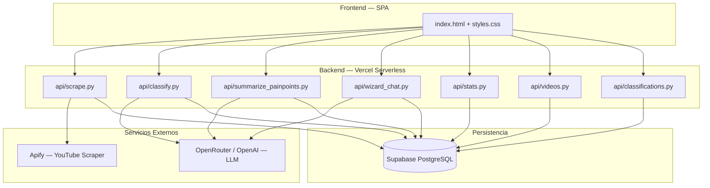
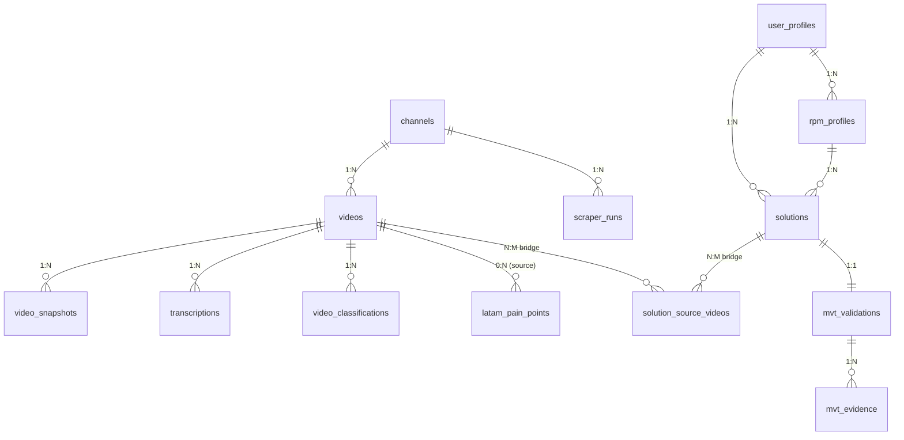

# MiPy de Celso — Sistema de Inteligencia de Negocios LATAM

> Plataforma web que extrae, clasifica y analiza videos de emprendimiento de [Starter Story](https://www.youtube.com/@StarterStory), identifica pain points del mercado latinoamericano mediante IA, y genera perfiles estratégicos RPM para descubrir oportunidades de negocio viables.

---

## Tabla de Contenidos

1. [Arquitectura General](#arquitectura-general)
2. [Stack Tecnológico](#stack-tecnológico)
3. [Pipeline de Datos](#pipeline-de-datos)
4. [Base de Datos — Diseño y Esquema](#base-de-datos--diseño-y-esquema)
5. [Endpoints de la API](#endpoints-de-la-api)
6. [Módulos del Frontend](#módulos-del-frontend)
7. [Variables de Entorno](#variables-de-entorno)
8. [Despliegue](#despliegue)
9. [Hoja de Ruta](#hoja-de-ruta)

---

## Arquitectura General

El sistema sigue una arquitectura de 3 capas con separación clara entre datos crudos, datos procesados y datos de usuario:

---

## Stack Tecnológico

| Componente | Tecnología |
|---|---|
| **Frontend** | HTML5 + CSS3 + JavaScript vanilla (SPA) |
| **Backend** | Python 3.x — Funciones serverless en Vercel |
| **Base de Datos** | PostgreSQL vía Supabase |
| **Scraping** | Apify (`pintostudio/youtube-transcript-scraper`) |
| **IA / LLM** | OpenRouter (auto-router free) con fallback a OpenAI `gpt-4o-mini` |
| **Hosting** | Vercel (deploy automático vía GitHub) |
| **Control de versiones** | Git + GitHub |

---

## Pipeline de Datos

El flujo completo del sistema opera en 4 fases secuenciales:

### Fase 1 — Scraping
1. El usuario ingresa URLs de YouTube en la interfaz.
2. `api/scrape.py` envía cada URL a Apify para extraer la transcripción.
3. Se persisten en Supabase: metadata del video (`videos`), transcripción completa (`transcriptions`) y un registro de ejecución (`scraper_runs`).
4. El scraper es **incremental**: si un video ya existe en la BD, se salta automáticamente.

### Fase 2 — Clasificación con IA
1. `api/classify.py` busca videos con transcripción que **aún no han sido clasificados**.
2. Envía la transcripción al LLM con un prompt estructurado que extrae:
   - Modelo de negocio
   - Fuente de ingresos
   - Cliente objetivo
   - **Pain Points extrapolados al contexto LATAM**
3. La respuesta JSON se almacena en `video_classifications`.
4. Cada pain point individual se inserta en `latam_pain_points` con su evidencia.

### Fase 2.5 — Resumen Estratégico
1. `api/summarize_painpoints.py` consolida todos los pain points de la BD.
2. El LLM genera un reporte estratégico del mercado LATAM.
3. El resumen se guarda en `latam_market_summary` para ser inyectado al Wizard RPM.

### Fase 3 — Wizard RPM
1. `api/wizard_chat.py` implementa un chat conversacional con el LLM.
2. Sigue el protocolo RPM (Rapid Planning Method de Tony Robbins):
   - **R — Results:** Metas concretas y cuantificables.
   - **P — Purpose:** Motivaciones emocionales profundas.
   - **M — Massive Action Plan:** Generado automáticamente por la IA cruzando el perfil del usuario con los pain points LATAM.
3. El perfil completo se guarda en `rpm_profiles`.

### Fase 4 — Soluciones y MVT *(pendiente)*
1. El motor de soluciones cruzará el perfil RPM con los pain points.
2. Generará propuestas de negocio con score de compatibilidad.
3. El módulo MVT permitirá registrar validaciones con evidencia real.

---

## Base de Datos — Diseño y Esquema

La base de datos PostgreSQL está alojada en **Supabase** y se organiza en **3 capas lógicas** con **14 tablas** relacionadas. El script de migración completo está en [`architecture/001_initial_schema.sql`](architecture/001_initial_schema.sql).

### Diagrama Relacional

### Capa 1 — Datos Crudos (Raw Layer)

| Tabla | Propósito | Campos clave |
|---|---|---|
| `channels` | Canales de YouTube registrados | `channel_id`, `name`, `is_active` |
| `videos` | Metadata estática de cada video | `video_id`, `title`, `url`, `published_at` |
| `video_snapshots` | Métricas dinámicas (views, likes) capturadas periódicamente | `views`, `likes`, `captured_at` |
| `transcriptions` | Transcripción completa + segmentos con timestamps | `full_text`, `segments` (JSONB), `source` |
| `scraper_runs` | Log de cada ejecución del scraper con estadísticas | `status`, `videos_found`, `videos_new`, `started_at` |

### Capa 2 — Datos Procesados (Analysis Layer)

| Tabla | Propósito | Campos clave |
|---|---|---|
| `video_classifications` | Resultado de la clasificación IA por video | `business_model`, `key_insights` (JSONB), `model_used` |
| `latam_pain_points` | Pain points extrapolados a LATAM con evidencia | `description`, `impact_level`, `evidence`, `source_video_id` |
| `latam_market_summary` | Resumen estratégico consolidado generado por IA | `summary_text`, `updated_at` |

### Capa 3 — Datos de Usuario y Delivery

| Tabla | Propósito | Campos clave |
|---|---|---|
| `user_profiles` | Perfil base del usuario | `display_name`, `email` |
| `rpm_profiles` | Perfil RPM versionado (Recursos, Procesos, Mercado) | `resources`, `process`, `market` (JSONB), `is_active` |
| `solutions` | Propuestas de negocio generadas por IA | `title`, `rpm_fit_score`, `difficulty`, `status` |
| `solution_source_videos` | Tabla puente N:M (solución ↔ videos fuente) | `solution_id`, `video_id` |
| `mvt_validations` | Resultado de validación MVT por solución | `decision` (Pivot/Proceed/Kill), `conversion_rate` |
| `mvt_evidence` | Evidencia real (conversaciones, tests, landing pages) | `evidence_type`, `content`, `outcome` |

### Decisiones de Diseño

- **UUIDs como PKs:** Todas las tablas usan `uuid_generate_v4()` para evitar colisiones y facilitar sincronización distribuida.
- **JSONB para datos semiestructurados:** Los campos `key_insights`, `segments`, `resources`, `process` y `market` usan JSONB para almacenar estructuras flexibles sin romper el esquema relacional.
- **Integridad referencial:** Foreign keys con `ON DELETE CASCADE` para mantener consistencia al borrar datos padre.
- **Índices estratégicos:** Índices en columnas de búsqueda frecuente (`video_id`, `channel_id`, `published_at`, `is_active`).
- **Triggers automáticos:** `updated_at` se actualiza automáticamente en `videos`, `user_profiles`, `solutions` y `mvt_validations`.
- **Scraper incremental:** `video_id UNIQUE` previene duplicación de datos entre ejecuciones.

---

## Endpoints de la API

Todas las funciones serverless están en `/api/` y se despliegan automáticamente en Vercel.

| Método | Endpoint | Descripción |
|---|---|---|
| `POST` | `/api/scrape` | Recibe URLs de YouTube, extrae transcripciones vía Apify y persiste en Supabase |
| `GET` | `/api/videos` | Devuelve lista de videos almacenados con metadata |
| `GET` | `/api/stats` | Métricas del dashboard: conteos, últimas ejecuciones, estado RPM |
| `POST` | `/api/classify` | Clasifica el siguiente video pendiente usando LLM |
| `GET` | `/api/classifications` | Galería de videos ya clasificados con sus pain points |
| `POST` | `/api/summarize_painpoints` | Genera resumen estratégico consolidado del mercado LATAM |
| `POST` | `/api/wizard_chat` | Chat conversacional para construir perfil RPM |

### Resiliencia del LLM

El sistema implementa un **mecanismo de fallback** para garantizar disponibilidad:

1. **Primario:** OpenRouter (`openrouter/free`) — Enruta automáticamente a modelos gratuitos disponibles.
2. **Fallback:** Si OpenRouter devuelve error `429` (límite de tarifa) y existe `OPENAI_API_KEY`, el sistema automáticamente usa OpenAI `gpt-4o-mini`.

---

## Módulos del Frontend

La interfaz es una SPA (Single Page Application) con navegación lateral:

| Pestaña | Funcionalidad |
|---|---|
| **Dashboard** | Métricas en tiempo real + log de ejecuciones recientes |
| **Entrega Hitos** | Galería de evidencias del proyecto (imágenes, videos) |
| **Scraper & Logs** | Ingreso de URLs + historial de ejecuciones en tabla |
| **Videos** | Cuadrícula visual de todos los videos scrapeados |
| **Pain Points LATAM** | Clasificación IA + galería de modelos y pain points + botón de resumen |
| **Wizard RPM** | Chat conversacional para construir perfil estratégico |
| **Motor de Soluciones** | *(pendiente)* Propuestas cruzadas RPM × Pain Points |
| **MVT** | *(pendiente)* Validación real de soluciones |

### Diseño Responsivo

- **Desktop (>900px):** Sidebar fijo lateral de 260px.
- **Tablet/Móvil (≤900px):** Sidebar colapsado con botón hamburguesa (☰). Se despliega sobre un overlay oscuro.
- Todos los iconos del menú son SVGs vectoriales que heredan los colores del branding.

---

## Variables de Entorno

Configuradas en el panel de **Vercel → Settings → Environment Variables**:

| Variable | Descripción |
|---|---|
| `APIFY_API_TOKEN` | Token de autenticación para la API de Apify |
| `SUPABASE_URL` | URL del proyecto Supabase |
| `SUPABASE_KEY` | Clave anónima (anon key) de Supabase |
| `DEEPSEEK_KEY` | API Key de OpenRouter |
| `OPENAI_API_KEY` | *(Opcional)* Clave de OpenAI como fallback |

---

## Despliegue

El despliegue es **completamente automático**:

1. Se hace `git push` al repositorio en GitHub.
2. Vercel detecta el cambio y ejecuta un nuevo build.
3. Las funciones Python en `/api/` se despliegan como funciones serverless.
4. El frontend (`index.html`, `styles.css`, `/assets/`) se sirve como contenido estático.

**URL de producción:** Disponible en el panel de Vercel del proyecto.

---

## Hoja de Ruta

| Fase | Estado | Descripción |
|---|---|---|
| Fase 1 — Scraping | ✅ Completa | Extracción y persistencia de videos y transcripciones |
| Fase 2 — Clasificación | ✅ Completa | Análisis IA + Pain Points LATAM + Resumen estratégico |
| Fase 3 — Wizard RPM | ✅ Completa | Chat conversacional para perfil estratégico |
| Fase 3b — Motor de Soluciones | 🔜 Pendiente | Cruza RPM × Pain Points para generar propuestas |
| Fase 4 — Validación MVT | 🔜 Pendiente | Tests reales con evidencia verificable |

---

## Documentación Técnica Adicional

| Archivo | Contenido |
|---|---|
| [`architecture/001_initial_schema.sql`](architecture/001_initial_schema.sql) | Migración SQL completa (14 tablas, índices, triggers, seed) |
| [`architecture/002_llm_extraction_sops.md`](architecture/002_llm_extraction_sops.md) | SOP y prompt para extracción semántica con IA |
| [`architecture/003_wizard_rpm_sops.md`](architecture/003_wizard_rpm_sops.md) | SOP y prompt maestro del Wizard RPM |
| [`branding-guidelines.md`](branding-guidelines.md) | Guía de estilos visuales (colores, tipografía, componentes) |
| [`gemini.md`](gemini.md) | Constitución del proyecto (schemas, reglas, invariantes) |

---

> **Última actualización:** 2026-05-11
