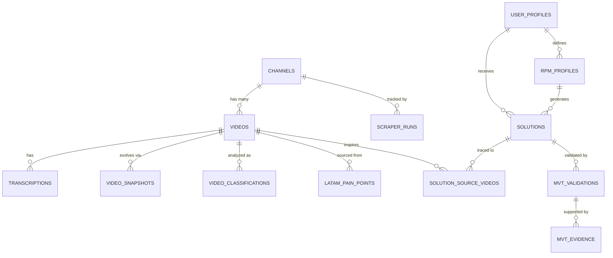

# 🗄️ Diseño de Base de Datos — Scrapscrap_celso

> Esquema Supabase (PostgreSQL) para el sistema de scraping, clasificación IA y generación de soluciones de negocio.

---

## Diagrama de Relaciones



---

## Tablas (14 tablas, 3 capas)

### 🟦 Capa 1 — Datos Crudos (Raw Layer)

| Tabla | Propósito |
|-------|-----------|
| `channels` | Canales de YouTube registrados (multi-canal desde día 1) |
| `videos` | Metadata estática de cada video scrapeado |
| `video_snapshots` | Evolución temporal de datos dinámicos (views, likes, comments) |
| `transcriptions` | Transcripciones completas extraídas vía Apify |
| `scraper_runs` | Historial de cada ejecución del scraper |

### 🟨 Capa 2 — Datos Procesados (Analysis Layer)

| Tabla | Propósito |
|-------|-----------|
| `video_classifications` | Análisis IA por video (modelo de negocio, industria, insights) |
| `latam_pain_points` | Pain points identificados con evidencia y video fuente |

### 🟩 Capa 3 — Datos de Usuario y Soluciones (User/Delivery Layer)

| Tabla | Propósito |
|-------|-----------|
| `user_profiles` | Perfil base del usuario |
| `rpm_profiles` | Perfil RPM versionado (Resources, Process, Market) |
| `solutions` | Soluciones de negocio generadas |
| `solution_source_videos` | Trazabilidad: solución ↔ videos que la inspiraron |
| `mvt_validations` | Registro de validación MVT por solución |
| `mvt_evidence` | Evidencia real: conversaciones, tests, métricas |

---

## Detalle por Tabla

### `channels`
| Campo | Tipo | Nota |
|-------|------|------|
| `id` | uuid (PK) | Auto-generado |
| `channel_id` | text (UNIQUE) | ID de YouTube del canal |
| `name` | text | Nombre del canal |
| `url` | text | URL del canal |
| `description` | text | Descripción |
| `is_active` | boolean | Si se debe scrapear activamente |
| `created_at` | timestamptz | |

### `videos`
| Campo | Tipo | Nota |
|-------|------|------|
| `id` | uuid (PK) | |
| `channel_id` | uuid (FK → channels) | Multi-canal |
| `video_id` | text (UNIQUE) | ID de YouTube del video |
| `title` | text | |
| `description` | text | |
| `url` | text | |
| `published_at` | timestamptz | Fecha de publicación |
| `duration_seconds` | integer | Duración en segundos |
| `thumbnail_url` | text | |
| `tags` | text[] | Array de tags |
| `language` | text | Idioma detectado |
| `created_at` / `updated_at` | timestamptz | |

### `video_snapshots`
> Permite observar cómo evolucionan views/likes/comments a lo largo del tiempo.

| Campo | Tipo | Nota |
|-------|------|------|
| `id` | uuid (PK) | |
| `video_id` | uuid (FK → videos) | |
| `views` | bigint | |
| `likes` | bigint | |
| `comments_count` | integer | |
| `captured_at` | timestamptz | Momento de la captura |

### `transcriptions`
| Campo | Tipo | Nota |
|-------|------|------|
| `id` | uuid (PK) | |
| `video_id` | uuid (FK → videos) | |
| `language` | text | Idioma de la transcripción |
| `full_text` | text | Texto concatenado (LLM-ready) |
| `segments` | jsonb | Array de `{start, duration, text}` |
| `source` | text | Ej: `apify_pinto_studio` |
| `created_at` | timestamptz | |

### `scraper_runs`
| Campo | Tipo | Nota |
|-------|------|------|
| `id` | uuid (PK) | |
| `channel_id` | uuid (FK → channels) | |
| `status` | text | `running` / `completed` / `failed` |
| `videos_found` | integer | Total encontrados |
| `videos_new` | integer | Nuevos insertados |
| `videos_updated` | integer | Actualizados |
| `errors` | jsonb | Errores registrados |
| `started_at` / `completed_at` | timestamptz | |

### `video_classifications`
> Separada de `videos` para mantener datos crudos ≠ datos IA.

| Campo | Tipo | Nota |
|-------|------|------|
| `id` | uuid (PK) | |
| `video_id` | uuid (FK → videos) | |
| `business_model` | text | Modelo de negocio detectado |
| `industry` | text | Industria |
| `revenue_range` | text | Rango de ingresos |
| `key_insights` | jsonb | Insights principales |
| `pain_points_identified` | jsonb | Pain points en el video |
| `latam_relevance_score` | integer (0-100) | Relevancia para LATAM |
| `model_used` | text | Qué LLM se usó |
| `prompt_version` | text | Versión del prompt |
| `classified_at` | timestamptz | |

### `latam_pain_points`
| Campo | Tipo | Nota |
|-------|------|------|
| `id` | uuid (PK) | |
| `description` | text | |
| `impact_level` | text | `Low` / `Medium` / `High` / `Critical` |
| `category` | text | Categoría del pain point |
| `evidence` | text | Evidencia textual |
| `source_video_id` | uuid (FK → videos) | Video de donde se extrajo |
| `created_at` | timestamptz | |

### `user_profiles`
| Campo | Tipo | Nota |
|-------|------|------|
| `id` | uuid (PK) | |
| `display_name` | text | |
| `email` | text (UNIQUE) | |
| `created_at` / `updated_at` | timestamptz | |

### `rpm_profiles`
> Versionado: cada vez que el usuario rehace el Wizard, se crea un nuevo registro. Solo uno es `is_active`.

| Campo | Tipo | Nota |
|-------|------|------|
| `id` | uuid (PK) | |
| `user_id` | uuid (FK → user_profiles) | |
| `resources` | jsonb | Recursos del usuario |
| `process` | jsonb | Procesos dominados |
| `market` | jsonb | Mercado objetivo |
| `raw_answers` | jsonb | Respuestas originales del wizard |
| `ai_interpretation` | jsonb | Interpretación procesada por IA |
| `version` | integer | Número de versión |
| `is_active` | boolean | Si es el perfil activo |
| `created_at` | timestamptz | |

### `solutions`
| Campo | Tipo | Nota |
|-------|------|------|
| `id` | uuid (PK) | |
| `user_id` | uuid (FK → user_profiles) | |
| `rpm_profile_id` | uuid (FK → rpm_profiles) | |
| `title` | text | |
| `description` | text | |
| `latam_adaptation` | text | Cómo se adapta a LATAM |
| `rpm_fit_score` | integer (0-100) | |
| `difficulty` | text | `Low` / `Medium` / `High` |
| `justification` | text | |
| `status` | text | `generated` / `reviewing` / `validating` / `validated` / `rejected` |
| `created_at` / `updated_at` | timestamptz | |

### `solution_source_videos`
> Tabla puente N:M — Trazabilidad completa de solución a videos fuente.

| Campo | Tipo | Nota |
|-------|------|------|
| `id` | uuid (PK) | |
| `solution_id` | uuid (FK → solutions) | |
| `video_id` | uuid (FK → videos) | |
| `relevance_note` | text | Por qué este video es relevante |

### `mvt_validations`
| Campo | Tipo | Nota |
|-------|------|------|
| `id` | uuid (PK) | |
| `solution_id` | uuid (FK → solutions, UNIQUE) | 1:1 con solución |
| `decision` | text | `Pivot` / `Proceed` / `Kill` |
| `conversion_rate` | float | |
| `engagement_score` | float | |
| `total_conversations` | integer | |
| `total_tests` | integer | |
| `created_at` / `updated_at` | timestamptz | |

### `mvt_evidence`
> Registra CADA pieza de evidencia real (conversaciones, tests).

| Campo | Tipo | Nota |
|-------|------|------|
| `id` | uuid (PK) | |
| `validation_id` | uuid (FK → mvt_validations) | |
| `evidence_type` | text | `conversation` / `test` / `survey` / `landing_page` |
| `content` | text | Contenido textual de la evidencia |
| `source` | text | Dónde ocurrió (WhatsApp, LinkedIn, etc.) |
| `outcome` | text | Resultado de la interacción |
| `evidence_url` | text | URL de prueba si aplica |
| `created_at` | timestamptz | |

---

## Respuesta a la Pregunta de Diseño

> *"Si mañana quisieras agregar un segundo canal de YouTube además de Starter Story, ¿tu esquema lo soporta sin rediseño total?"*

**Sí, sin tocar una sola línea de SQL.** Solo insertarías una nueva fila en `channels`:

```sql
INSERT INTO channels (channel_id, name, url, is_active)
VALUES ('UC_nuevo_canal', 'My First Million', 'https://youtube.com/@MyFirstMillion', true);
```

Todos los videos, transcripciones, clasificaciones y snapshots ya llevan `channel_id` como FK. El scraper solo necesita leer los canales con `is_active = true`.

---

## Índices Estratégicos

| Índice | Propósito |
|--------|-----------|
| `videos.video_id` (UNIQUE) | Deduplicación rápida en scraping incremental |
| `videos.channel_id` | Filtrar videos por canal |
| `videos.published_at` | Ordenar/filtrar por fecha |
| `video_snapshots (video_id, captured_at)` | Consultar evolución temporal |
| `transcriptions.video_id` | Join rápido video ↔ transcripción |
| `video_classifications.video_id` | Join rápido video ↔ clasificación |
| `solutions.user_id` | Soluciones por usuario |
| `rpm_profiles (user_id, is_active)` | Encontrar perfil RPM activo rápido |
